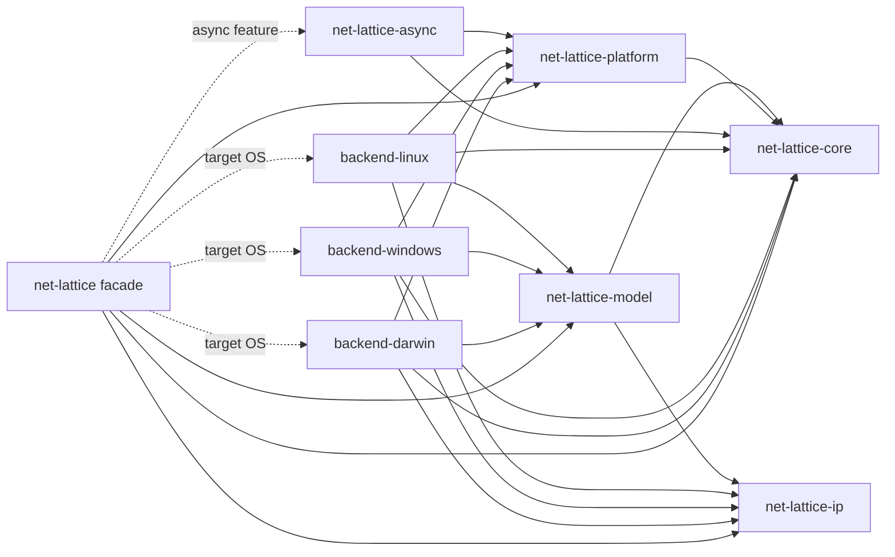

# Net Lattice project index

Net Lattice is a cross-platform Rust library for inspecting and configuring
operating-system networking through one strongly typed facade. The supported
platform backends are Linux, Windows, and macOS.

## Workspace map

```text
net-lattice/
├── crates/
│   ├── net-lattice-core/       Shared Error, Result, and typed IDs
│   ├── net-lattice-ip/         IPv4, IPv6, prefixes, and networks
│   ├── net-lattice-model/      Platform-independent observed/desired models
│   ├── net-lattice-platform/   Generic provider and capability contracts
│   ├── net-lattice-backend-linux/   Linux Netlink implementation
│   ├── net-lattice-backend-windows/ Windows IP Helper implementation
│   ├── net-lattice-backend-darwin/  macOS BSD/PF_ROUTE/ioctl implementation
│   ├── net-lattice-async/       Runtime-independent futures::Stream adapter
│   └── net-lattice/             Public facade, validation, and transaction executor
├── .github/workflows/           Cross-platform CI and privileged coverage jobs
├── .codex/                      Reusable Codex rules, roles, and templates
├── .claude/                     Reusable Claude Code rules, roles, and templates
├── scripts/                     Repository helper scripts
├── ARCHITECTURE.md              English architecture and roadmap
├── ARCHITECTURE.ru.md           Russian architecture and roadmap
├── README.md                    English user documentation
├── README.ru.md                 Russian user documentation
├── CHANGELOG.md                 Release history
├── SECURITY.md                  Vulnerability reporting policy
├── SUPPORT.md                   Support and project status
├── CONTRIBUTING.md              Contribution workflow
├── AGENTS.md                    Repository agent entry point
└── index.md                     This project map
```

## Lattice ecosystem

Net Lattice is the first crate in a wider Lattice family of composable,
cross-platform Rust networking libraries:

```text
net-lattice      OS networking inspection/configuration (routes, DNS, interfaces) — this repo
tunnel-lattice   TUN/TAP tunnel interfaces
dns-lattice      Programmable DNS control plane
flow-lattice     Policy compiler: rules -> platform-neutral network plans
sdk-lattice      Application-facing SDK composing the crates above
```

The other four repositories (https://github.com/F000NKKK/{tunnel,dns,flow,sdk}-lattice)
are in the bootstrap stage: repository workflow and packaging scaffolding
exist, ported from this repo, but no implementation or public API has shipped
yet. Cross-repository dependency direction and API boundaries have not been
decided; they will be recorded as ADRs once that design work happens. Do not
assume any of these repositories track this repo's roadmap stage.

## Dependency direction

Arrows mean “depends on”.



`net-lattice-platform` must remain independent of `net-lattice-model`.
The facade binds generic provider associated types to concrete model types.
Mutation data belongs in `net-lattice-model`; execution orchestration remains
an internal facade component until repeated reuse justifies a new crate.

## Current release and roadmap

Published stage baseline: the `net-lattice 0.21` release line (see
`SECURITY.md`'s supported-version table). Read the current workspace version
from `crates/net-lattice/Cargo.toml`; do not duplicate a patch version here.

- 0.1–0.14: completed inspection, monitoring, imperative mutation, and
  mutation-plan model stages.
- 0.15: completed ordered transaction execution, runtime preflight,
  cancellation, typed snapshots, explicit compensation, and phase-aware
  reports.
- 0.16: completed and verified by privileged Linux, Windows, and macOS CI:
  desired `InterfaceConfig`, capability-gated MTU/admin-state mutation,
  read-after-write, and executor integration on all built-in backends.
- 0.17: completed and verified by privileged Linux, Windows, and macOS CI:
  static ARP/NDP neighbor mutation (`NeighborMutator`,
  `Capability::NEIGHBOR_MUTATION`), the `RouteProvider`/`RouteMutator` split
  (`Capability::ROUTE_MUTATION`, ADR-0002), IPv6 DNS parity, and isolated
  destructive topology acceptance for route/address/neighbor CRUD and
  compensation.
- 0.18: completed and released (`0.18.0`): consistent whole-system
  `CurrentState` snapshots (`SnapshotProvider`, `Lattice::current_state()`)
  with explicit scope/consistency/partial-read semantics, plus the
  domain-scoped `net_lattice::model`/`mutation`/`monitoring` re-export
  modules replacing the former crate-root re-export (breaking).
- 0.19: completed and released (`0.19.1`): `DesiredState` and inspectable
  `Diff`/`Diff::compute` in `net-lattice-model` (pure, no backend/native
  dependency), plus the `RouteConfig` route-mutation intent type and the
  accompanying `RouteMutator` binding change (breaking).
- 0.20: completed and released (`0.20.0`): declarative apply through the
  transaction executor — `ApplyPlan::compile`, `Lattice::execute_apply_plan`,
  and the `Lattice::apply` convenience.
- 0.21: completed and released (`0.21.0`/`0.21.1`): pre-1.0 compatibility and
  hardening audit — the `Addition` tier (ADR-0014/`NL-A-16`), `Error`
  `#[non_exhaustive]` (ADR-0015/`NL-A-17`), the "Frozen 1.0 Public API
  Surface" inventory in `ARCHITECTURE.md`, and full rustdoc coverage
  (`#![warn(missing_docs)]` on every crate). The path to `1.0` is closed:
  the compatibility audit it is gated on is done, and `1.0.0` is ready for
  its first stable release whenever the user runs the release script.

The completed Stage 0.16/0.17 plan and audit records are maintained as
internal working-tree evidence. The next-stage planning workspace is
likewise kept outside the published crate documentation.
`.codex/`, this index, and root `AGENTS.md` are intentionally local agent
context in this checkout and are not release content.

## Stage 0.17 delivered contract

```text
observed NeighborEntry                    observed Route
        ▲                                         ▲
        │ read-after-write                        │ native acknowledgement
NeighborMutator ← StaticNeighbor intent    RouteMutator ← Route intent
        │                                         │
        └── NEIGHBOR_MUTATION capability          └── ROUTE_MUTATION capability
```

`NeighborMutator` is new (ADR-0001): its `StaticNeighbor` input is distinct
from `NeighborEntry` (no synthesized ID or observed state), and removal
refuses a present but non-`Permanent` (dynamically learned) entry with
`InvalidState`. `RouteProvider` was split into `RouteProvider`/`RouteMutator`
(ADR-0002), the last domain to gain the provider/mutator boundary already
used everywhere else; `Route` itself is unchanged (no new intent type, since
it carries no OS-synthesized field). Both preserve the Stage 0.15
`ExecutionOptions` API and explicit-compensation boundary. Privileged
shared-runner tests validate native submission/readback/removal and
cancellation-triggered compensation on Linux, Windows, and macOS.

## Stage 0.16 delivered contract

```text
observed Interface
        ▲
        │ read-after-write
InterfaceMutator ← InterfaceConfig intent
        │
        ├── MTU capability
        └── administrative-state capability
```

The implementation preserves the Stage 0.15 `ExecutionOptions` API and
explicit-compensation boundary, relies on existing native `Interface::Changed`
event mappings, and keeps ordinary tests non-privileged and non-destructive.
Privileged shared-runner tests validate native submission/readback/restoration;
destructive end-to-end event proof requires an isolated test interface.

## Useful commands

```text
cargo fmt --all -- --check
cargo test --workspace --all-features --exclude net-lattice-backend-linux
cargo clippy --workspace --all-targets --all-features -- -D warnings
cargo doc --workspace --all-features --no-deps
cargo package -p net-lattice --allow-dirty --list
git diff --check
```

Privileged backend tests are run by the platform CI jobs with the required
Linux capabilities, Windows administrator context, or macOS privileges.
